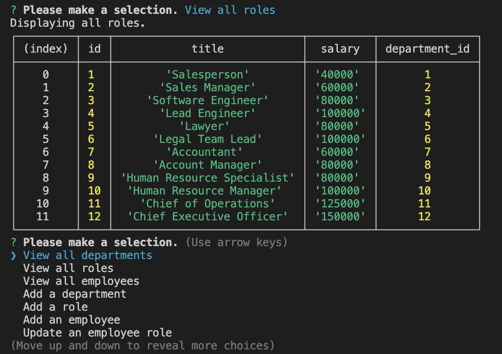

# Employee-Tracker-Application

## Table of Contents
* [Description](#description)
* [Installation](#installation)
* [Links](#links)
* [Usage](#usage)
* [Demo](#demo)
* [Questions](#questions)

## Description
This is an Employee Tracker Application which was created using node.js, express.js, inquirer, and mySQL. 

## Installation
1.  Clone the repository to your computer locally. 

2. If your computer does not have node.js already installed, go to [Nodejs.org](https://nodejs.org/en/download/), and download the node.js v16.18.0 installer for your platform.

3. Install [DBeaver](https://dbeaver.io/download/) to create the Employee Tracker Database, and use schema.sql and seeds.sql to insert the data.

## Usage

Once inquirer is installed, in the command line run:  `node index.js` .

Follow the prompts to view departments, roles, and/or employees as well as add a department, role, and/or employee, update an employee, or exit when finished.

## Links
GitHub Repository: [Employee Tracker Application](https://github.com/kdrummond528/Employee-Tracker-App)

## Demo

<b><u>Home Screen:</b></u>

<b><u>Viewing Departments Display:</b></u>

<b><u>Viewing Roles Display:</b></u>

<b><u>Viewing Employees Display:</b></u>

[Instructional Video](https://drive.google.com/file/d/17UNm-jFyQuiBUPir9nAadYdxMvWCAg8p/view?usp=sharing)

## Questions

Feel free to [email me](mailto:k.drummond528@gmail.com) with any questions, comments, or requests.

Checkout my [GitHub profile](https://github.com/kdrummond528)!